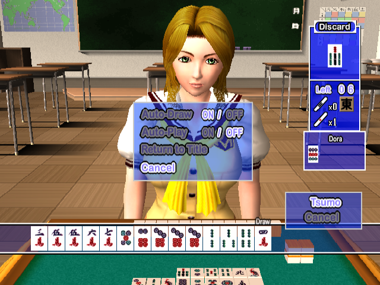

# Love-Mahjong-English-Translation-Patch
An English translation patch for "Simple 2000 Ultimate Vol. 5: Love * Mahjong" [SLPM-62248] PS2 game developed by HuneX and published by D3Publisher.

**Patch is in xdelta format and was tested with MD5: cd2add33801946aad2d61cdeff9e8368 copy of the game.**

## Features:
* All in-game text and UI/Menus were translated from Japanese to English.

## Tools used:
* [PCSX2](https://pcsx2.net/) - Debugging.
* [QuickBMS](https://aluigi.altervista.org/quickbms.htm) - LZSS decompression, compression.
* [MKPSXISO](https://github.com/Lameguy64/mkpsxiso) - Extraction and rebuilding of BIN image.
* [Delta Patcher](https://github.com/marco-calautti/DeltaPatcher) - Creation of patch file.

## Screenshots

