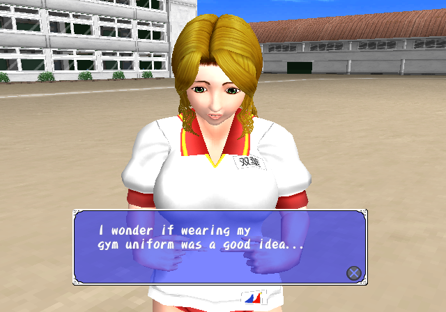
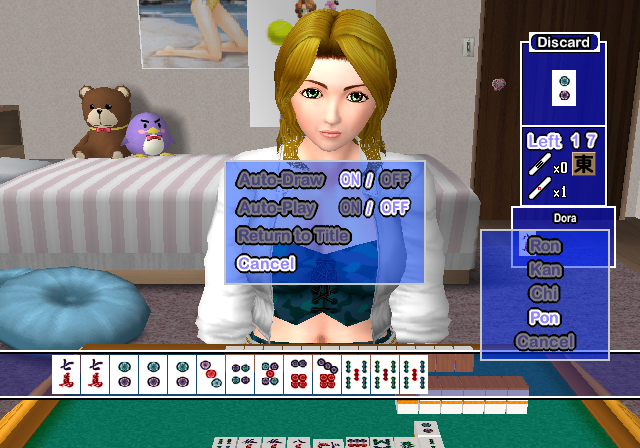
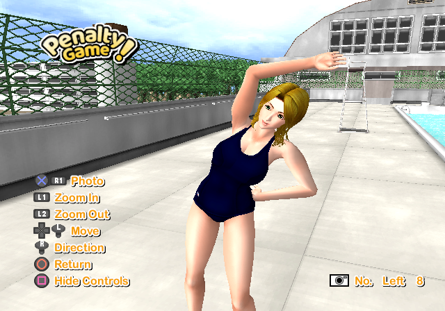
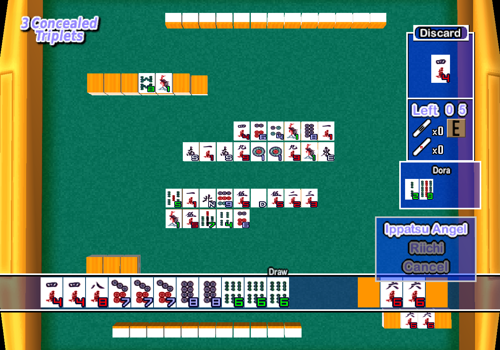

# Love-Mahjong-English-Translation-Patch
An English translation patch for "Simple 2000 Ultimate Vol. 5: Love * Mahjong" [SLPM-62248] PS2 game developed by HuneX and published by D3Publisher.

**Patch is in xdelta format and was tested with MD5: cd2add33801946aad2d61cdeff9e8368 copy of the game.**

## Features:
* All in-game text and UI/Menus were translated from Japanese to English.
* Swapped × and ○ button inputs.
* Includes additional patch that adds extra markings to the tiles (1-9 to number tiles, E S W N to wind tiles and D to dragon tiles). However, due to a low resolution of the original texture, it is only recommended to use it when playing on the emulator with at least 2x resolution scale.

## Tools used:
* [PCSX2](https://pcsx2.net/) - Debugging.
* [QuickBMS](https://aluigi.altervista.org/quickbms.htm) - LZSS decompression, compression.
* [MKPSXISO](https://github.com/Lameguy64/mkpsxiso) - Extraction and rebuilding of BIN image.
* [Delta Patcher](https://github.com/marco-calautti/DeltaPatcher) - Creation of patch file.

## Resources:
* Mahjong
  - [Riichi.Wiki](https://riichi.wiki/Main_Page)
  - [Wikipedia](https://en.wikipedia.org/wiki/Yaku_(Japanese_mahjong))
  - [Yakuza Wiki](https://yakuza.fandom.com/wiki/Mahjong)
  - [Mahjong College](https://mahjongcollege.com/category/term/)
  - [Mahjongo](https://mahjongo.com/ja/learn/riichi)
* Credits
  - [MobyGames](https://www.mobygames.com/)
* 3D models
  - [Wikipedia](https://en.wikipedia.org/wiki/Wavefront_.obj_file)
  - [paulbourke.net](https://paulbourke.net/dataformats/obj)
  - [3D screenshot fork of PCSX2](https://github.com/scurest/pcsx2)
  - [Sample .obj files](https://groups.csail.mit.edu/graphics/classes/6.837/F03/models/)

## Screenshots

